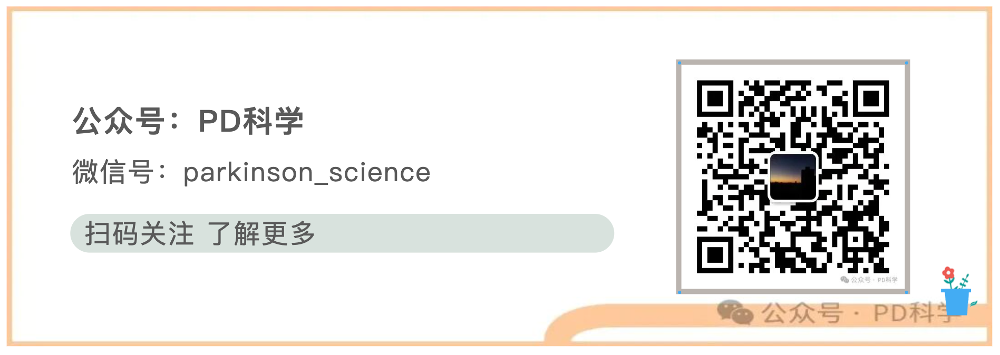

# 🧠 PD科学 — 帕金森病前沿科研助手

> 聚焦帕金森疾病（PD）前沿动态，实时追踪全球最新科研成果与临床突破。  
> 深度解读权威文献，搭建医患科普桥梁，传递科学诊疗资讯。

**PD科学 — 帕金森病前沿科研助手** 是一个基于大语言模型的智能问答系统，专门服务于帕金森病领域的科研工作者、临床医生、患者及家属。它严格依托于精心整理的专业知识库进行回答，不编造、不泛化，致力于成为抗帕之路上一个可信赖的AI伙伴。

---

## ✨ 功能特点

-   **🧬 知识驱动回答** — 不依赖大模型自身的泛化知识，所有回答严格基于本公众号整理的专业知识库，杜绝幻觉
-   **🔄 实时追踪前沿** — 知识库随时更新，纳入最新的临床试验结果、靶点发现和学术争议
-   **💬 自然对话交互** — 基于Streamlit构建的聊天界面，打字机流式输出，使用体验流畅

---

## 🤖online-agent

## 🚀 欢迎关注公众号：PD科学
